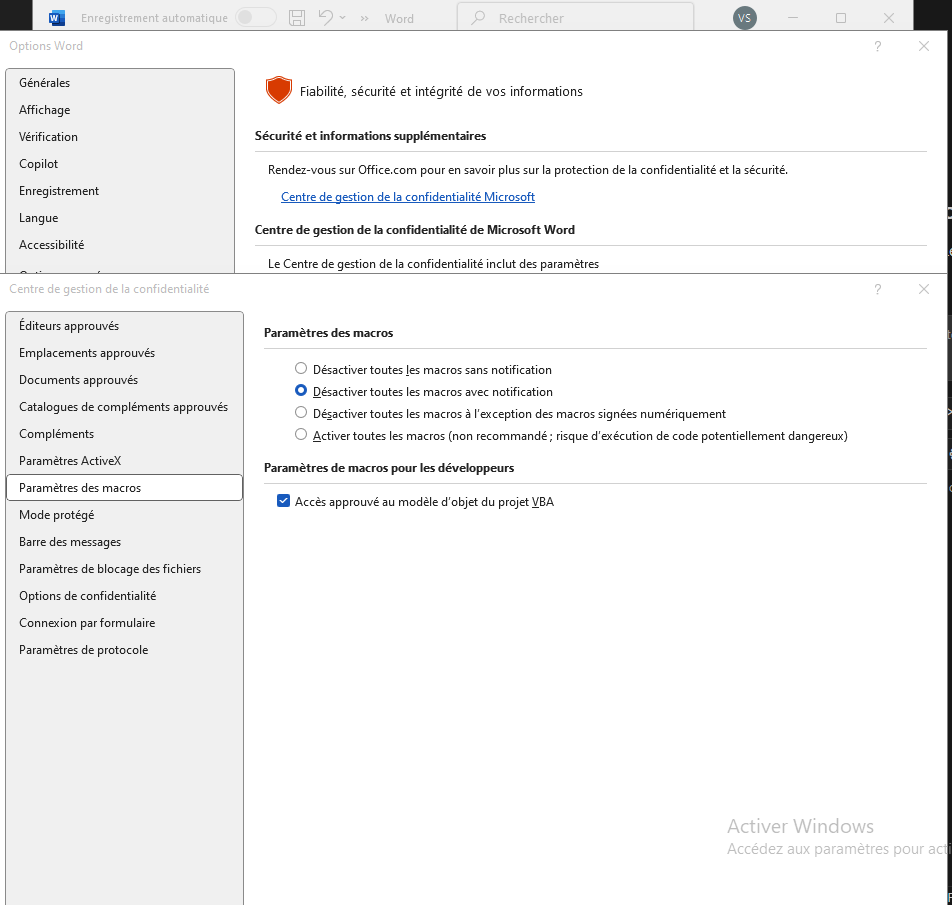
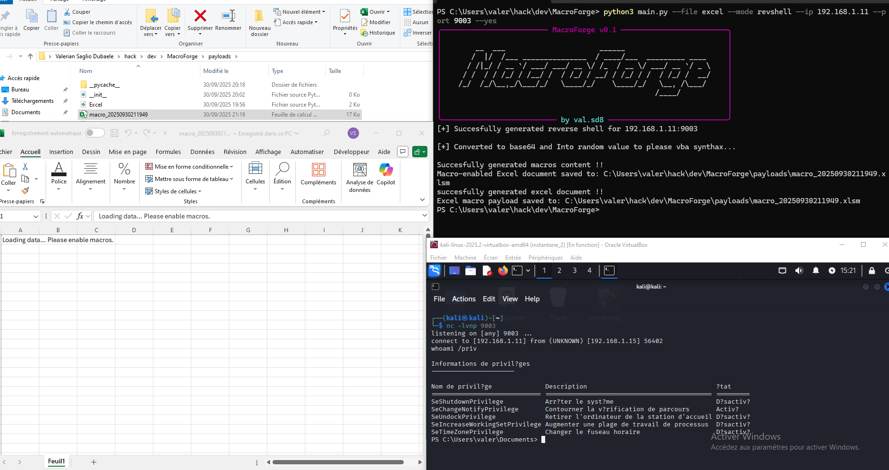
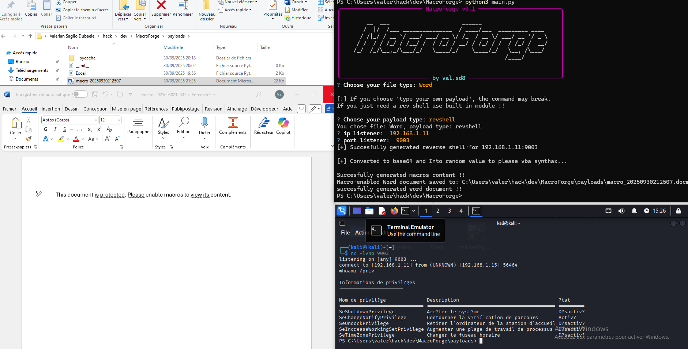

# ⚔️ MacroForge

> Generate simple Office macros . Created by `val.sd8`.


---

## 🔍 Description

**MacroForge** is an Office macro generator designed to generate simple reverse shell and powershell commands in Word / Excel macros.

- CLI and questionnary usage

-More feature comming soon !!

> ⚠️ For **educational and authorized** use only.

---

## 🛠️ Installation (You may need to use a virtual python env)

```bash
git clone https://github.com/yourusername/macroforge.git
cd macroforge
pip install -r requirements.txt
```

## Usage

For now this only run on windows where office is installed. Dont forget to check this case in Word and Excel or else it will fails. 





**Getting a reverse shell using the cli**


**Getting a reverse shell using the interactive prompt**

